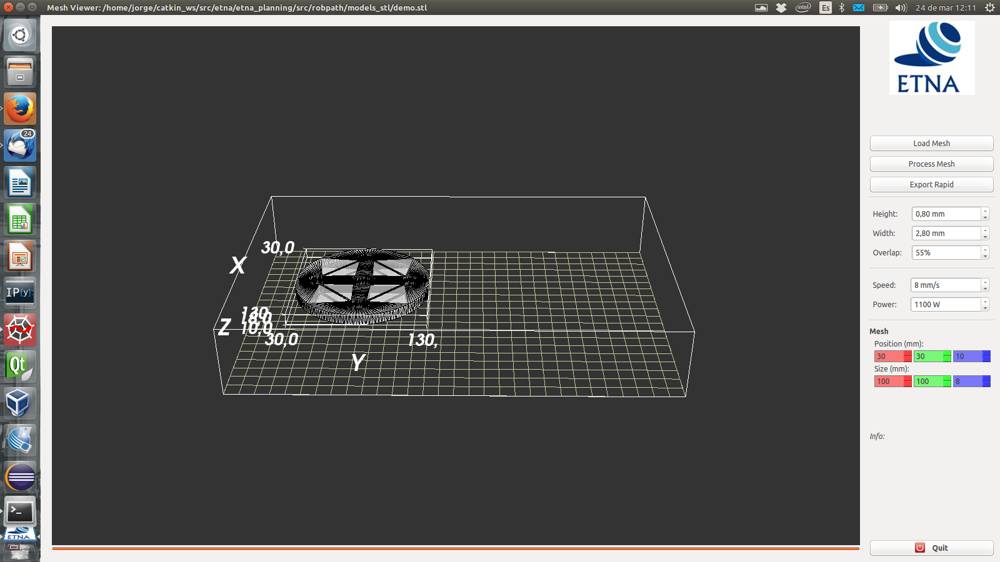
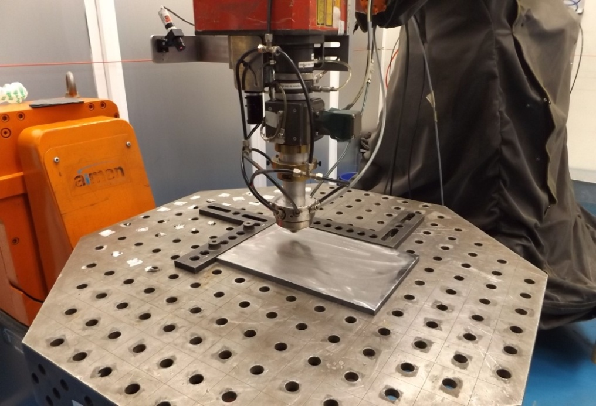
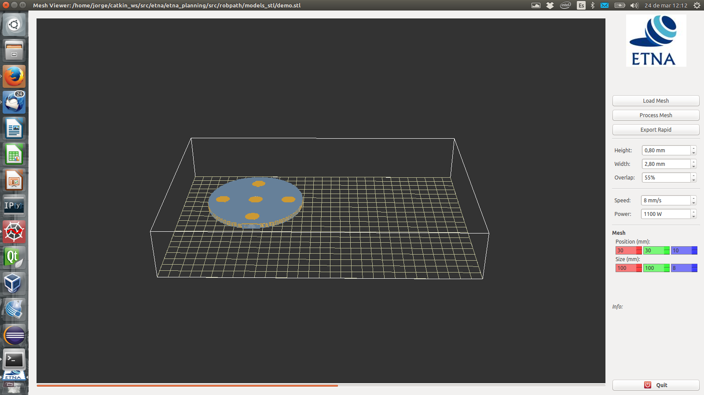

# RobPath

RobPath is a simple off-line path planning tool for direct manufacturing through robotized LMD.
Based on conventional processing strategies, this tool automatically generates the robot tool
path from the 3D part model, assuming constant parameters during the process, following the next
steps:

- Loading the 3D model from a mesh described in STL format.
- Slicing the mesh in different layers with a fixed thick.
- Calculating the filling path required to get a solid layer.
- Generating the robot routine required for LMD robotized cell.

A simple interface is provided to process the 3D mesh model, with only three buttons. One of this
buttons is used to load the STL file, while the model is shown on the interface main window.

*GUI of RobPath with integrated setting parameters.*

Loaded the model, the software shows it on a virtual grid that represents the working space where
the job is going to take place. Using the controllers on the bottom of the right panel the model
can be resized and located on the required place to be manufactured.

*Picture shown the reference of the virtual grid in the real laser cell.*

When the model is placed, another button is used to process the model with the set parameters.
Assuming constant track width, overlap, and track height, the system calculates the tool path.
Besides this parameters, the interface also allow to set on the lateral panel the process
parameters (e.g. velocity, laser power, powder feed rate). The third button is required to export
the robot routine to the robot control unit.

*GUI showing the layer-by-layer path planning process.*

Furthermore, this CAM program is integrated to directly control the AIMEN LMD cell path planning
and programming, and it is used for the path generation for different LMD applications.
